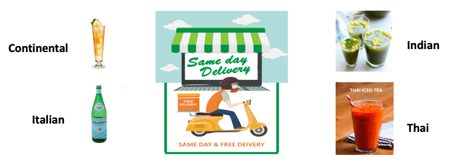
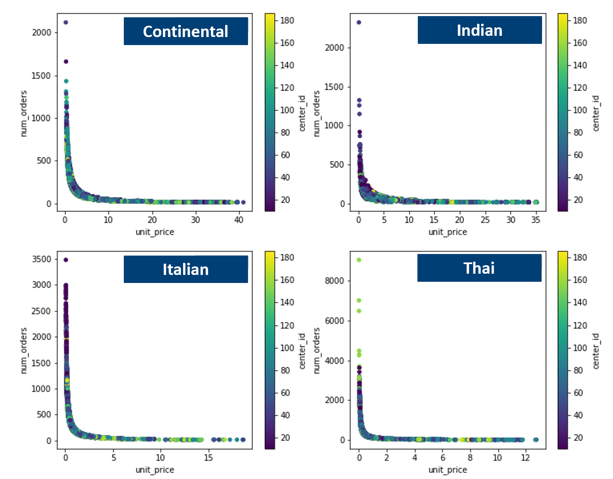
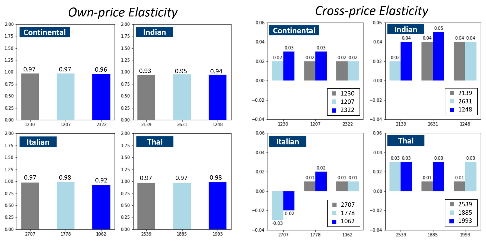
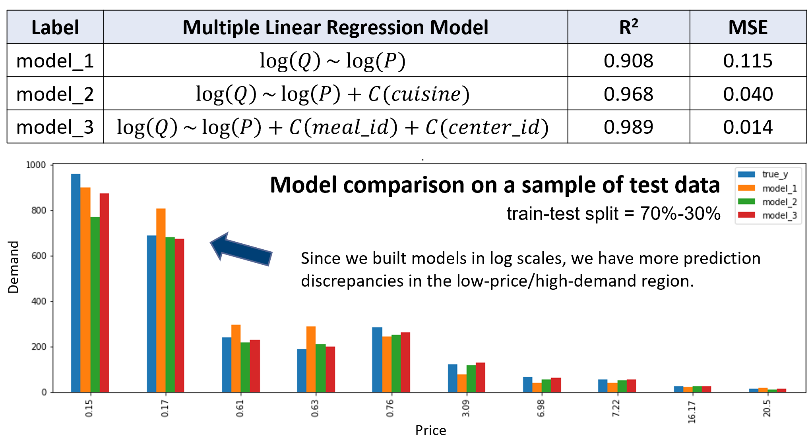
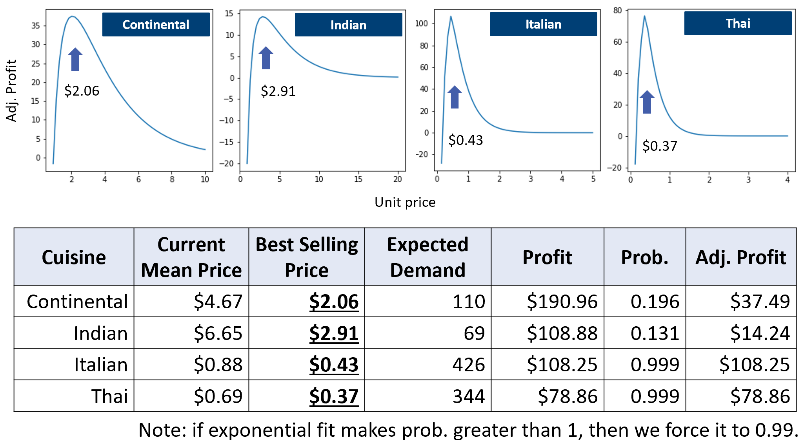

#  Price, Demand and Profit Analysis in the Beverage Category for a Food Delivery Company

## Documentation

Click **[food_delivery_v1.ipynb](food_delivery_v1.ipynb)** to see the FULL analysis.

## Background

Analyze the demand curve, price elasticity for different beverages for a food delivery company in India, which has multiple food centers. Build demand prediction models and propose optimal prices for 4 different cuisine types of beverages.

## Key Business Questions

1. How is the price-demand interaction for the beverages in the same cuisine category?
2. What are the major features to predict the demand?
3. What is the optimal price of beverages to maximize the profit?

## [Dataset](https://datahack.analyticsvidhya.com/contest/genpact-machine-learning-hackathon-1/)

The dataset contains aggregated weekly sales for different food categories. There are 77 different centers and some centers have up to 145 weeks of data. It also has base_price, checkout_price, num_orders, and promotion record via email or homepage.

## Data pre-processing

1. Eliminate the rows with email and homepage promotion.
2. Select rows with `category == Beverages` 
3. Construct a new column, `unit_price` = `base_price` / `num_orders` 

## Demand Curve

Each cuisine type has 3 kinds of beverages. We plotted the demand curve by cuisine.

Customers are responded consistently to the price regardless of the product differences in the same cuisine type. Only Indian beverages have a thicker line, which means it has more demand variations at a given price. 

## Own & Cross Price Elasticity

1. All coefficients are significant. 
2. All own-price elasticity are close to 1 (inelastic), which means customers are less sensitive to the price change. 
3. All cross-price elasticity are low, which tells us the demand is not affected by other products in the same category. 
4. Note that the cross-price elasticity of Italian 2707 has negative values - Italian 2707 could be a bundled drink of other Italian beverages.

## Demand Prediction

- We learn that the demand is mostly not affected by other products. We want to see which model describes the demand the best.  

## Find the Best Price to Maximize Profit

1. Assume the best price is the same for all products for each cuisine
2. The cost of beverages is 20% of the mean price for each cuisine
3. Choose `model_2` for the demand (Q) - good fit & generalized enough
4. Use **exponential function (pdf)** to describe the customer behavior - probability of `sum(num_orders)` for each price of each cuisine

## Team 

(left to right) Jerry Chen, Xuemeng Wu, Jenny Zhang
